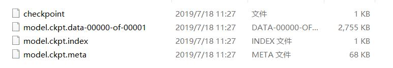

# 为方便以后使用，生成了模型，如何恢复及使用
<!--more-->
### 通过保存模型，得到四个模型文件
```
meta文件保存了当前图结构

data文件保存了当前参数名和值

index文件保存了辅助索引信息

checkpoint文件会记录保存信息，通过它可以定位最新保存的模型
```
### `tf.train.import_meta_graphimport_meta_grap(meta_graph_or_file,clear_devices=False,import_scope=None,**kwargs)`
这个方法可以从文件中将保存的graph的所有节点加载到当前的default graph中，并返回一个saver。也就是说，我们在保存的时候，除了将变量的值保存下来，其实还有将对应graph中的各种节点保存下来，所以模型的结构也同样被保存下来了。
### 如果在restore方法中填这个文件名，就会报错，应该填的是前缀，这个前缀可以使用tf.train.latest_checkpoint(checkpoint_dir)这个方法获取

```
天坑aaaa：代码需要运用已经训练好的模型，进行一些数据的计算，并给出计算结果，但是代码在运行的时候发现，同样一组数据，每次运行代码后，获得的从之前训练好的模型中得到的输出，每次运行结果都不同
（1）测试中，要将网络中使用的tf.nn.dropout的keep_prob为1
（2）在load checkpoint的代码完成之后，代码中运行了下列代码sess.run(tf.global_variables_initializer())这样导致，载入的checkpoint的数据失效，所有数据重新进行了初始化，导致模型是个随机的取值，从而每次运行获得的结果不同。
解决的办法也很简单，在load checkpoint的操作之前，先运行初始化的代码，然后再导入checkpoint.
```