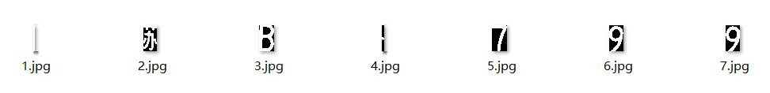
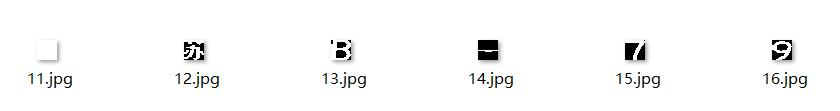

# 我在用tensorflow训练模型的时候，发现一个问题，由于训练的图片分辨率是固定的，但是我把训练好的模型拿来使用的时候，往往需要用来分类的图片分辨率不是我训练的分辨率。所以这个时候需要使用pnencv的resize来把图片重新缩放成模型的分辨率。
<!--more-->
`void resize(InputArray src, OutputArray dst, Size dsize, double fx=0, double fy=0, int interpolation=INTER_LINEAR ); `

参数介绍：src：输入，原图像，即待改变大小的图像；

dst：输出，改变大小之后的图像，这个图像和原图像具有相同的内容，只是大小和原图像不一样而已；

dsize：输出图像的大小。如果这个参数不为0，那么就代表将原图像缩放到这个Size(width，height)指定的大小；如果这个参数为0，那么原图像缩放之后的大小就要通过下面的公式来计算：

dsize = Size(round(fx*src.cols), round(fy*src.rows))

其中，fx和fy就是下面要说的两个参数，是图像width方向和height方向的缩放比例。

fx：width方向的缩放比例，如果它是0，那么它就会按照(double)dsize.width/src.cols来计算；

fy：height方向的缩放比例，如果它是0，那么它就会按照(double)dsize.height/src.rows来计算；

interpolation：这个是指定插值的方式，图像缩放之后，肯定像素要进行重新计算的，就靠这个参数来指定重新计算像素的方式，有以下几种：
>INTER_NEAREST - 最邻近插值
INTER_LINEAR - 双线性插值，如果最后一个参数你不指定，默认使用这种方法
INTER_AREA - resampling using pixel area relation. It may be a preferred method for image decimation, as it gives moire’-free results. But when the image is zoomed, it is similar to the INTER_NEAREST method.
INTER_CUBIC - 4x4像素邻域内的双立方插值
INTER_LANCZOS4 - 8x8像素邻域内的Lanczos插值

### 直接上代码 批量处理
```
import cv2
import os

picpath = './Parting/'

for root, dirs, files in os.walk(picpath):
    i=10
    for file in files:
        i+=1
        picpp = root + file
        image = cv2.imread(picpp)
        image = cv2.resize(image, (20,20), interpolation=cv2.INTER_NEAREST)
        # cv2.imshow("2",image)
        # cv2.waitKey(0)
        # cv2.destroyAllWindows()
        savepath =picpath+'%d.jpg' % i
        cv2.imwrite(savepath,image)

```
### 处理结果如下


