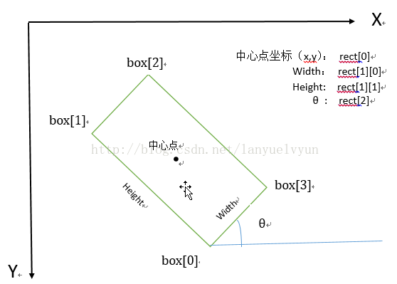

# opencv图像处理函数的基本使用（以及粗略原理）
<!--more-->
## 一.基本函数
1.cv2.imread()：读入图片，共两个参数，第一个参数为要读入的图片文件名，第二个参数为如何读取图片，包括cv2.IMREAD_COLOR：读入一副彩色图片；cv2.IMREAD_GRAYSCALE：以灰度模式读入图片；

2.cv2.IMREAD_UNCHANGED：读入一幅图片，并包括其alpha通道。

3.cv2.imshow()：创建一个窗口显示图片，共两个参数，第一个参数表示窗口名字，可以创建多个窗口中，但是每个窗口不能重名；第二个参数是读入的图片。

4.cv2.waitKey()：键盘绑定函数，共一个参数，表示等待毫秒数，将等待特定的几毫秒，看键盘是否有输入，返回值为ASCII值。如果其参数为0，则表示无限期的等待键盘输入。

5.cv2.destroyAllWindows()：删除建立的全部窗口。

6.cv2.destroyWindows()：删除指定的窗口。

7.cv2.imwrite()：保存图片，共两个参数，第一个为保存文件名，第二个为读入图片。
## 二.高斯模糊
>效果:
可以来退出由照相机或其他环境产生的噪声，减少在边缘提取时的其余边缘的数目。高斯模糊本质上是低通滤波器，输出图像的每个像素点是原图像上对应像素点与周围像素点的加权和

`blur = cv2.GaussianBlur(img,(5,5),0)`
这里(5, 5)表示高斯矩阵的长与宽都是5，标准差取0时OpenCV会根据高斯矩阵的尺寸自己计算。概括地讲，高斯矩阵的尺寸越大，标准差越大，处理过的图像模糊程度越大。也可以自己构造高斯核，相关函数cv2.GaussianKernel().

详细原理见[高斯分布原理]("")
## 三.中值滤波
中值滤波是基于排序统计理论的一种能有效抑制噪声的非线性信号处理技术，对脉冲噪声有良好的滤除作用，特别是在滤除噪声的同时，能够保护信号的边缘，使之不被模糊。这些优良特性是线性滤波方法所不具有的。此外，中值滤波的算法比较简单，也易于用硬件实现。

中值滤波就是将当前像素值替换为模板覆盖范围内的所有像素值中大小居中那一个：对于一个3*3的模板，第5大的就是中值：
（10,15,20,20,20,20,20,25,100）

中值滤波使得那些更亮（或者更暗）的点更像他周围的值。所以它在滤除噪音的同时，可以较好地保留细节轮廓。

`cv2.medianBlur(gaussian, 5)`
## 四.soble算子边缘检测
对噪声具有平滑作用，提供较为精确的边缘方向信息，边缘定位精度不够高；
当对精度要求不是很高时，是一种较为常用的边缘检测方法。

`sobelx = cv2.Sobel(img,cv2.CV_64F, 1, 0, ksize=3)`
1. img表示源图像，即进行边缘检测的图像
2. cv2.CV_64F表示64位浮点数即64float。这里不使用
3. numpy.float64，因为可能会发生溢出现象
4. 第三和第四个参数分别是对X和Y方向的导数（即dx,dy），这里1表示对X求偏导，0表示不对Y求导。其中，X还可以求2次导。
注意：对X求导就是检测垂直方向的边缘，对Y求导是检测水平方向的边缘
5. 第五个参数ksize是指核的大小。
这里说明一下，这个参数的前四个参数都没有给谁赋值，而ksize则是被赋值的对象。实际上，这时可省略的参数，而前四个是不可省的参数。注意其中的不同点

详细原理见[soble算子边缘检测原理]("")
## 五.图像固定阈值二值化处理threshold
定义：图像的二值化，就是将图像上的像素点的灰度值设置为0或255，也就是将整个图像呈现出明显的只有黑和白的视觉效果。

灰度值0：黑，灰度值255：白

   一幅图像包括目标物体、背景还有噪声，要想从多值的数字图像中直接提取出目标物体，常用的方法就是设定一个阈值T，用T将图像的数据分成两部分：大于T的像素群和小于T的像素群。这是研究灰度变换的最特殊的方法，称为图像的二值化（Binarization）。

`ret, binary =cv2.threshold(img, threshold, maxval,type)`
1. threshold是设定的阈值
2. maxval是当灰度值大于（或小于）阈值时将该灰度值赋成的值
3. type规定的是当前二值化的方式

* cv2.THRESH_BINARY    大于阈值的部分被置为255，小于部分被置为0 
* cv2.THRESH_BINARY_INV    大于阈值部分被置为0，小于部分被置为255 
* cv2.THRESH_TRUNC     大于阈值部分被置为threshold，小于部分保持原样
* cv2.THRESH_TOZERO   小于阈值部分被置为0，大于部分保持不变
* cv2.THRESH_TOZERO_INV    大于阈值部分被置为0，小于部分保持不变 

其实还有很重要的cv2.THRESH_OTSU   作为图像自适应二值化的一个很优的算法Otsu大津算法的参数：
使用为cv2.threshold(img, 0, 255, cv2.THRESH_OTSU )
## 六.膨胀和腐蚀
>  膨胀： 
此操作将图像(A)与任意形状的内核 (B)，通常为正方形或圆形,进行卷积。内核 B 有一个可定义的 锚点, 通常定义为内核中心点。进行膨胀操作时，将内核 B 划过图像,将内核 B 覆盖区域的最大相素值提取，并代替锚点位置的相素。显然，这一最大化操作将会导致图像中的亮区开始”扩展” (因此有了术语膨胀 dilation )。 这种操作会造成图像中像素值高的区域变大，而像素值小的区域变小，等一下看你一下效果你就知道了！！！

>腐蚀： 
跟膨胀操作造作的效果刚好相反。腐蚀在形态学操作家族里是膨胀操作的孪生姐妹。它提取的是内核覆盖下的相素最小值。进行腐蚀操作时，将内核 B 划过图像,将内核 B 覆盖区域的最小相素值提取，并代替锚点位置的相素。以与膨胀相同的图像作为样本,我们使用腐蚀操作。

我们一般使用函数 getStructuringElement配合这个参数的使用。getStructuringElement函数会返回指定形状和尺寸的结构元素（内核矩阵）。

`element1 = cv2.getStructuringElement(cv2.MORPH_RECT, (9, 1))`

内核矩形：MORPH_RECT，第二个参数是内核的尺寸

膨胀一次，让轮廓突出

`dilation = cv2.dilate(binary, element2, iterations=1)`

腐蚀一次，去掉细节

`erosion = cv2.erode(dilation, element1, iterations=1)`
(iterations:迭代)
## 七.轮廓检测与绘制
`contours, hierarchy = cv2.findContours(img, cv2.RETR_TREE, cv2.CHAIN_APPROX_SIMPLE)`

三个输入参数：输入图像（二值图像），轮廓检索方式，轮廓近似方法
+ cv2.RETR_TREE:建立一个等级树结构的轮廓
+ cv2.CHAIN_APPROX_SIMPLE:压缩垂直、水平、对角方向，只保留端点

返回值：轮廓，轮廓的层析结构

绘制轮廓
`cv2.drawContours(img, [box], -1, (0, 255, 0), 2)`

五个输入参数：原始图像，轮廓（python列表），轮廓的索引（当设置为-1时，绘制所有轮廓），画笔颜色，画笔大小
## 八.最小面积矩形
`rect = cv2.minAreaRect(points)`
其中points是点集，数据类型为ndarray，array((x1,y1),(x2,y2),....,(xn,yn))
而minAreaRect就是求出在上述点集下的最小面积矩形

 rect[0]返回矩形的中心点，（x,y），实际上为y行x列的像素点

利用：cv2.boxPoints(rect)可以返回四个点的值，其中cv2.boxPoints(rect)[0]为point[0]，cv2.boxPoints(rect)[1]为point[1]......

