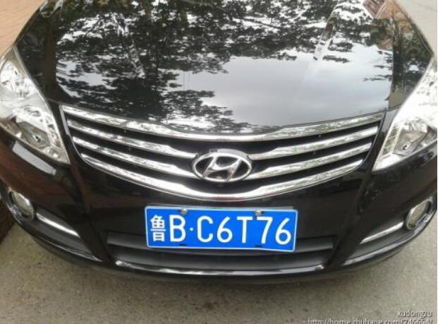
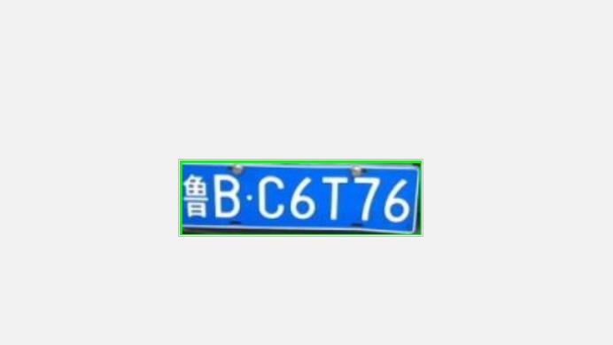
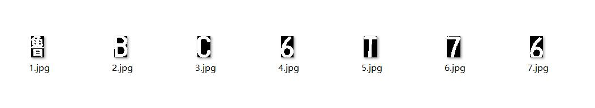

## 这是一个基于python+opencv+cnn的车牌识别，先说一下缺点和限制条件:1.只能识别蓝色中国车牌（因为是基于颜色进行车牌定位的） 2.尽量保持与车牌垂直（不具备倾斜矫正功能）
<!--more-->
## 可以大体将其分为三步来完成：(1)车牌定位     (2)车牌字符分割         (3)字符识别                                                
 ## 1.车牌定位
 ### 刚开始我用基于形状定位，对开闭操作的二值图，符合一定比例的进行查找，但是结果不是太好，于是改用基于颜色，将蓝色像素设为255，其他区域置0，这次结果还可以。但是实际测试局限太多，不能定位蓝色车辆，甚至不能出现蓝色物品，否则轮廓检测时，多个轮廓无法识别（限制条件： if len(car_plates) == 1）
 ### 代码如下

```python
 #-*- coding: utf-8 -*-
import cv2
import numpy as np

#预处理
def imgProcess(path):
    img = cv2.imread(path)
    # 统一规定大小
    img = cv2.resize(img, (640, 480))
    # 高斯模糊
    img_Gas = cv2.GaussianBlur(img, (5, 5), 0)
    # RGB通道分离
    img_B = cv2.split(img_Gas)[0]
    img_G = cv2.split(img_Gas)[1]
    img_R = cv2.split(img_Gas)[2]
    # 读取灰度图和HSV空间图
    img_gray = cv2.cvtColor(img_Gas, cv2.COLOR_BGR2GRAY)
    img_HSV = cv2.cvtColor(img_Gas, cv2.COLOR_BGR2HSV)
    return img, img_Gas, img_B, img_G, img_R, img_gray, img_HSV


#初步识别
def preIdentification(img_gray, img_HSV, img_B, img_R):
    lower_red = np.array([100, 43, 46])
    upper_red = np.array([124, 255, 255])
    mask = cv2.inRange(img_HSV, lower_red, upper_red)
    kernel = np.ones((7, 7))
    img_close = cv2.morphologyEx(mask, cv2.MORPH_CLOSE, kernel, iterations=1)  # 闭操作，填充闭合区域
    img_open = cv2.morphologyEx(img_close, cv2.MORPH_OPEN, kernel, iterations=5)  # 开操作，消除白色小点
    #cv2.imshow("1", img_open)
    #cv2.waitKey(0)
    return img_open


def predict(imageArr):
    contours, hierarchy = cv2.findContours(imageArr, cv2.RETR_TREE, cv2.CHAIN_APPROX_SIMPLE)
    return contours


def chose_licence_plate(contours, Min_Area=2000):
    temp_contours = []
    for contour in contours:
        if cv2.contourArea(contour) > Min_Area:
            temp_contours.append(contour)
    car_plate = []
    for temp_contour in temp_contours:
        rect_tupple = cv2.minAreaRect(temp_contour)
        rect_width, rect_height = rect_tupple[1]
        if rect_width < rect_height:
            rect_width, rect_height = rect_height, rect_width
        aspect_ratio = rect_width / rect_height
        # 车牌正常情况下宽高比在2 - 5.5之间
        if aspect_ratio > 2 and aspect_ratio < 5.5:
            car_plate.append(temp_contour)
            rect_vertices = cv2.boxPoints(rect_tupple)
            rect_vertices = np.int0(rect_vertices)
    print("符合轮廓数：",len(car_plate))
    return car_plate


def license_segment(car_plates, img):
    if len(car_plates) == 1:
        for car_plate in car_plates:
            row_min, col_min = np.min(car_plate[:, 0, :], axis=0)
            row_max, col_max = np.max(car_plate[:, 0, :], axis=0)
            cv2.rectangle(img, (row_min, col_min), (row_max, col_max), (0, 255, 0), 2)
            card_img = img[col_min:col_max, row_min:row_max, :]
            #cv2.imshow("img", img)
        #cv2.imshow("card_img.jpg", card_img)
        cv2.imwrite("./License plate/card_img.jpg",card_img)
        #cv2.waitKey(0)
        #cv2.destroyAllWindows()


def location():
    #path = input("请输入识别图片位置：\n")
    path = './image/25.jpg'
    img, img_Gas, img_B, img_G, img_R, img_gray, img_HSV = imgProcess(path)
    img_pretreat = preIdentification(img_gray, img_HSV, img_B, img_R)
    contours = predict(img_pretreat)
    car_plate = chose_licence_plate(contours)
    license_segment(car_plate, img)


if __name__ == '__main__':
    location()
```

### 原始图片

### 定位后


## 2.车牌字符分割
### 这也是比较重要的，前两步其实都是为第三步服务的，字符分割的好坏对结果也是有一定的影响的，单字符分割主要策略就是检测列像素的总和变化，因为没有字符的区域基本是黑色，像素值低；有字符的区域白色较多，列像素和就变大了！列像素变化的阈值是个问题，看到很多博客是固定的阈值进行检测，除非你处理后的二值化图像非常完美，不然有的图片混入了白色区域就会分割错误！以列像素的均值作为阈值参考标准[思路来源]("https://www.bbsmax.com/A/RnJWO8LgJq/")，但是效果并不好，最后采用函数remove_plate_upanddown_border作用就是去除上下干扰部分，在进行垂直投影

### 代码如下

```python
 #-*- coding: utf-8 -*-
import cv2
import numpy as np

#根据设定的阈值和图片直方图，找出波峰，用于分隔字符
def find_waves(threshold, histogram):
    up_point = -1  # 上升点
    is_peak = False
    if histogram[0] > threshold:
        up_point = 0
        is_peak = True
    wave_peaks = []
    for i, x in enumerate(histogram):
        if is_peak and x < threshold:
            if i - up_point > 2:
                is_peak = False
                wave_peaks.append((up_point, i))
        elif not is_peak and x >= threshold:
            is_peak = True
            up_point = i
    if is_peak and up_point != -1 and i - up_point > 4:
        wave_peaks.append((up_point, i))
    return wave_peaks


def remove_plate_upanddown_border(card_img):
    """
    这个函数将截取到的车牌照片转化为灰度图，然后去除车牌的上下无用的边缘部分，确定上下边框
    输入： card_img是从原始图片中分割出的车牌照片
    输出: 在高度上缩小后的字符二值图片
    """
    plate_Arr = cv2.imread(card_img)
    plate_gray_Arr = cv2.cvtColor(plate_Arr, cv2.COLOR_BGR2GRAY)
    ret, plate_binary_img = cv2.threshold(plate_gray_Arr, 0, 255, cv2.THRESH_BINARY + cv2.THRESH_OTSU)
    row_histogram = np.sum(plate_binary_img, axis=1)  # 数组的每一行求和
    row_min = np.min(row_histogram)
    row_average = np.sum(row_histogram) / plate_binary_img.shape[0]
    row_threshold = (row_min + row_average) / 2
    wave_peaks = find_waves(row_threshold, row_histogram)
    # 接下来挑选跨度最大的波峰
    wave_span = 0.0
    for wave_peak in wave_peaks:
        span = wave_peak[1] - wave_peak[0]
        if span > wave_span:
            wave_span = span
            selected_wave = wave_peak
    plate_binary_img = plate_binary_img[selected_wave[0]:selected_wave[1], :]
    #cv2.imshow("plate_binary_img", plate_binary_img)
    #cv2.waitKey(0)
    #cv2.destroyAllWindows()
    return plate_binary_img

def getVProjection(image):
    vProjection = np.zeros(image.shape,np.uint8);
    #图像高与宽
    (h,w) = image.shape
    #长度与图像宽度一致的数组
    w_ = [0]*w
    #循环统计每一列白色像素的个数
    for x in range(w):
        for y in range(h):
            if image[y,x] == 255:
                w_[x]+=1
    #绘制垂直平投影图像
    for x in range(w):
        for y in range(h-w_[x],h):
            vProjection[y,x] = 255
    #cv2.imshow('vProjection',vProjection)
    return w_

def parting():
    path=('./License plate/card_img.jpg')
    origineImage=cv2.imread(path)
    binary_img=remove_plate_upanddown_border(path)
    (h, w) = binary_img.shape
    i=0
    # 对行图像进行垂直投影
    W = getVProjection(binary_img)
    Wstart = 0
    Wend = 0
    W_Start = 0
    W_End = 0
    for j in range(len(W)):
        if W[j] > 0 and Wstart == 0:
                W_Start = j
                Wstart = 1
                Wend = 0
        if W[j] <= 0 and Wstart == 1:
                W_End = j
                Wstart = 0
                Wend = 1
        if Wend == 1:
                # cv2.imshow("%s"%j, plate_binary_img1[:,W_Start:W_End])
                # cv2.waitKey(0)
                # cv2.destroyAllWindows()
                if(W_End-W_Start<10):
                    continue
                else:
                    i += 1
                    cv2.imwrite('parting/' + '%s.jpg' %i,binary_img[:,W_Start:W_End])
                Wend = 0

if __name__ == '__main__':
    parting()
```

### 字符分割后

## 3.字符识别模型训练
### 代码如下

```python
#-*- coding: utf-8 -*-
import sys
import os
import time
import random
import numpy as np
import tensorflow as tf

from PIL import Image

SIZE = 400
WIDTH = 20
HEIGHT = 20
NUM_CLASSES = 31
iterations = 1000

SAVER_DIR = "province model/"

LETTERS_DIGITS = ("川","鄂","赣","甘","贵","桂","黑","沪","冀","津","京","吉","辽","鲁","蒙","闽",
"宁","青","琼","陕","苏","晋","皖","湘","新","豫","渝","粤","云","藏","浙")
license_num = ""

time_begin = time.time()

#定义输入节点，对应于图片像素值矩阵集合和图片标签(即所代表的数字)
x = tf.placeholder(tf.float32, shape=[None, SIZE])
y_ = tf.placeholder(tf.float32, shape=[None, NUM_CLASSES])

x_image = tf.reshape(x, [-1, WIDTH, HEIGHT, 1])


#定义卷积函数
def conv_layer(inputs, W, b, conv_strides, kernel_size, pool_strides, padding):
    L1_conv = tf.nn.conv2d(inputs, W, strides=conv_strides, padding=padding)
    L1_relu = tf.nn.relu(L1_conv + b)
    return tf.nn.max_pool(L1_relu, ksize=kernel_size, strides=pool_strides, padding='SAME')


#定义全连接层函数
def full_connect(inputs, W, b):
    return tf.nn.relu(tf.matmul(inputs, W) + b)


if __name__ == '__main__' and sys.argv[1] == 'train':
    # 第一次遍历图片目录是为了获取图片总数
    input_count = 0
    for i in range(0,31):
        dir = './cnn_char_train/province/%s/' % i  # 这里可以改成你自己的图片目录，i为分类标签
        for rt, dirs, files in os.walk(dir):
            for filename in files:
                input_count += 1

    # 定义对应维数和各维长度的数组
    input_images = np.array([[0] * SIZE for i in range(input_count)])
    input_labels = np.array([[0] * NUM_CLASSES for i in range(input_count)])

    # 第二次遍历图片目录是为了生成图片数据和标签
    index = 0
    for i in range(0,31):
        dir = './cnn_char_train/province/%s/' % i  # 这里可以改成你自己的图片目录，i为分类标签
        for rt, dirs, files in os.walk(dir):
            for filename in files:
                filename = dir + filename
                img = Image.open(filename)
                im = img.convert('L')
                width = img.size[0]
                height = img.size[1]
                for h in range(0, height):
                    for w in range(0, width):
                        # 通过这样的处理，使数字的线条变细，有利于提高识别准确率
                        if im.getpixel((w,h)) > 230:
                            input_images[index][w + h * width] = 0
                        else:
                            input_images[index][w + h * width] = 1
                input_labels[index][i] = 1
                index += 1

    # 第一次遍历图片目录是为了获取图片总数
    val_count = 0
    for i in range(0,31):
        dir = './cnn_char_train/province/%s/' % i  # 这里可以改成你自己的图片目录，i为分类标签
        for rt, dirs, files in os.walk(dir):
            for filename in files:
                val_count += 1

    # 定义对应维数和各维长度的数组
    val_images = np.array([[0] * SIZE for i in range(val_count)])
    val_labels = np.array([[0] * NUM_CLASSES for i in range(val_count)])

    # 第二次遍历图片目录是为了生成图片数据和标签
    index = 0
    for i in range(0,31):
        dir = './cnn_char_train/province/%s/' % i  # 这里可以改成你自己的图片目录，i为分类标签
        for rt, dirs, files in os.walk(dir):
            for filename in files:
                filename = dir + filename
                img = Image.open(filename)
                im = img.convert('L')
                width = img.size[0]
                height = img.size[1]
                for h in range(0, height):
                    for w in range(0, width):
                        # 通过这样的处理，使数字的线条变细，有利于提高识别准确率
                        if im.getpixel((w, h)) > 230:
                            val_images[index][w + h * width] = 0
                        else:
                            val_images[index][w + h * width] = 1
                val_labels[index][i] = 1
                index += 1

    with tf.Session() as sess:
        # 第一个卷积层
        W_conv1 = tf.Variable(tf.truncated_normal([8, 8, 1, 16], stddev=0.1), name="W_conv1")
        b_conv1 = tf.Variable(tf.constant(0.1, shape=[16]), name="b_conv1")
        conv_strides = [1, 1, 1, 1]
        kernel_size = [1, 2, 2, 1]
        pool_strides = [1, 2, 2, 1]
        L1_pool = conv_layer(x_image, W_conv1, b_conv1, conv_strides, kernel_size, pool_strides, padding='SAME')

        # 第二个卷积层
        W_conv2 = tf.Variable(tf.truncated_normal([5, 5, 16, 32], stddev=0.1), name="W_conv2")
        b_conv2 = tf.Variable(tf.constant(0.1, shape=[32]), name="b_conv2")
        conv_strides = [1, 1, 1, 1]
        kernel_size = [1, 1, 1, 1]
        pool_strides = [1, 1, 1, 1]
        L2_pool = conv_layer(L1_pool, W_conv2, b_conv2, conv_strides, kernel_size, pool_strides, padding='SAME')

        # 全连接层
        W_fc1 = tf.Variable(tf.truncated_normal([10 * 10 * 32, 512], stddev=0.1), name="W_fc1")
        b_fc1 = tf.Variable(tf.constant(0.1, shape=[512]), name="b_fc1")
        h_pool2_flat = tf.reshape(L2_pool, [-1, 10 * 10 * 32])
        h_fc1 = full_connect(h_pool2_flat, W_fc1, b_fc1)

        # dropout
        keep_prob = tf.placeholder(tf.float32,name='keep_prob')

        h_fc1_drop = tf.nn.dropout(h_fc1, keep_prob)

        # readout层
        W_fc2 = tf.Variable(tf.truncated_normal([512, NUM_CLASSES], stddev=0.1), name="W_fc2")
        b_fc2 = tf.Variable(tf.constant(0.1, shape=[NUM_CLASSES]), name="b_fc2")

        # 定义优化器和训练op
        y_conv = tf.matmul(h_fc1_drop, W_fc2) + b_fc2
        cross_entropy = tf.reduce_mean(tf.nn.softmax_cross_entropy_with_logits(labels=y_, logits=y_conv))
        train_step = tf.train.AdamOptimizer((1e-4)).minimize(cross_entropy)

        correct_prediction = tf.equal(tf.argmax(y_conv, 1), tf.argmax(y_, 1))
        accuracy = tf.reduce_mean(tf.cast(correct_prediction, tf.float32))

        sess.run(tf.global_variables_initializer())

        time_elapsed = time.time() - time_begin
        print("读取图片文件耗费时间：%d秒" % time_elapsed)
        time_begin = time.time()

        print("一共读取了 %s 个训练图像， %s 个标签" % (input_count, input_count))

        # 设置每次训练op的输入个数和迭代次数，这里为了支持任意图片总数，定义了一个余数remainder，譬如，如果每次训练op的输入个数为60，图片总数为150张，则前面两次各输入60张，最后一次输入30张（余数30）
        batch_size = 60
        iterations = iterations
        batches_count = int(input_count / batch_size)
        remainder = input_count % batch_size
        print("训练数据集分成 %s 批, 前面每批 %s 个数据，最后一批 %s 个数据" % (batches_count + 1, batch_size, remainder))

        # 执行训练迭代
        for it in range(iterations):
            # 这里的关键是要把输入数组转为np.array
            for n in range(batches_count):
                train_step.run(feed_dict={x: input_images[n * batch_size:(n + 1) * batch_size],
                                          y_: input_labels[n * batch_size:(n + 1) * batch_size], keep_prob: 0.5})
            if remainder > 0:
                start_index = batches_count * batch_size;
                train_step.run(feed_dict={x: input_images[start_index:input_count - 1],
                                          y_: input_labels[start_index:input_count - 1], keep_prob: 0.5})

            # 每完成五次迭代，判断准确度是否已达到100%，达到则退出迭代循环
            iterate_accuracy = 0
            if it % 5 == 0:
                iterate_accuracy = accuracy.eval(feed_dict={x: val_images, y_: val_labels, keep_prob: 1.0})
                print('第 %d 次训练迭代: 准确率 %0.5f%%' % (it, iterate_accuracy * 100))
                if iterate_accuracy >= 0.999 :
                    break;

        print('完成训练!')
        time_elapsed = time.time() - time_begin
        print("训练耗费时间：%d秒" % time_elapsed)
        time_begin = time.time()

        # 保存训练结果
        if not os.path.exists(SAVER_DIR):
            print('不存在训练数据保存目录，现在创建保存目录')
            os.makedirs(SAVER_DIR)
        # 初始化saver
        saver = tf.train.Saver()
        saver_path = saver.save(sess, "%sprovince model.ckpt" % (SAVER_DIR))

if __name__ == '__main__' and sys.argv[1] == 'predict':
    saver = tf.train.import_meta_graph("%smodel.ckpt.meta" % (SAVER_DIR))
    with tf.Session() as sess:
        model_file = tf.train.latest_checkpoint(SAVER_DIR)
        saver.restore(sess, model_file)

        # 第一个卷积层
        W_conv1 = sess.graph.get_tensor_by_name("W_conv1:0")
        b_conv1 = sess.graph.get_tensor_by_name("b_conv1:0")
        conv_strides = [1, 1, 1, 1]
        kernel_size = [1, 2, 2, 1]
        pool_strides = [1, 2, 2, 1]
        L1_pool = conv_layer(x_image, W_conv1, b_conv1, conv_strides, kernel_size, pool_strides, padding='SAME')

        # 第二个卷积层
        W_conv2 = sess.graph.get_tensor_by_name("W_conv2:0")
        b_conv2 = sess.graph.get_tensor_by_name("b_conv2:0")
        conv_strides = [1, 1, 1, 1]
        kernel_size = [1, 1, 1, 1]
        pool_strides = [1, 1, 1, 1]
        L2_pool = conv_layer(L1_pool, W_conv2, b_conv2, conv_strides, kernel_size, pool_strides, padding='SAME')

        # 全连接层
        W_fc1 = sess.graph.get_tensor_by_name("W_fc1:0")
        b_fc1 = sess.graph.get_tensor_by_name("b_fc1:0")
        h_pool2_flat = tf.reshape(L2_pool, [-1, 10 * 10 * 32])
        h_fc1 = full_connect(h_pool2_flat, W_fc1, b_fc1)

        # dropout
        keep_prob = tf.placeholder(tf.float32)

        h_fc1_drop = tf.nn.dropout(h_fc1, keep_prob)

        # readout层
        W_fc2 = sess.graph.get_tensor_by_name("W_fc2:0")
        b_fc2 = sess.graph.get_tensor_by_name("b_fc2:0")

        # 定义优化器和训练op
        conv = tf.nn.softmax(tf.matmul(h_fc1_drop, W_fc2) + b_fc2)

        for n in range(20,21):
            path = "parting/%s.jpg" % (n)
            img = Image.open(path)
            width = img.size[0]
            height = img.size[1]
            im = img.convert('L')
            img_data = [[0] * SIZE for i in range(1)]
            for h in range(0, height):
                for w in range(0, width):
                    if im.getpixel((w, h)) < 190:
                        img_data[0][w + h * width] = 1
                    else:
                        img_data[0][w + h * width] = 0

            result = sess.run(conv, feed_dict={x: np.array(img_data), keep_prob: 1.0})

            max1 = 0
            max2 = 0
            max3 = 0
            max1_index = 0
            max2_index = 0
            max3_index = 0
            for j in range(NUM_CLASSES):
                if result[0][j] > max1:
                    max1 = result[0][j]
                    max1_index = j
                    continue
                if (result[0][j] > max2) and (result[0][j] <= max1):
                    max2 = result[0][j]
                    max2_index = j
                    continue
                if (result[0][j] > max3) and (result[0][j] <= max2):
                    max3 = result[0][j]
                    max3_index = j
                    continue

            license_num = license_num + LETTERS_DIGITS[max1_index]
            print("概率：  [%s %0.2f%%]    [%s %0.2f%%]    [%s %0.2f%%]" % (
            LETTERS_DIGITS[max1_index], max1 * 100, LETTERS_DIGITS[max2_index], max2 * 100, LETTERS_DIGITS[max3_index],
            max3 * 100))

        print("车牌编号是: 【%s】" % license_num)
```      


## 4.最后的模型恢复与预测(再一次构建网络，有点笨）
### 代码如下

```python
#-*- coding: utf-8 -*-
import cv2
import os
import tensorflow as tf
from PIL import Image
from License_plate_location import *
from Character_parting import *

SIZE = 400
WIDTH = 20
HEIGHT = 20
iterations = 1000

letter_model = "model/"
province_model="province model/"

LETTERS_DIGITS = ("0", "1", "2", "3", "4", "5", "6", "7", "8", "9", "A", "B", "C", "D", "E", "F", "G", "H", "J", "K", "L", "M", "N", "P",
"Q", "R", "S", "T", "U", "V", "W", "X", "Y", "Z")
province=("川","鄂","赣","甘","贵","桂","黑","沪","冀","津","京","吉","辽","鲁","蒙","闽",
"宁","青","琼","陕","苏","晋","皖","湘","新","豫","渝","粤","云","藏","浙")

x = tf.placeholder(tf.float32, shape=[None, SIZE],name='x')
x_image = tf.reshape(x, [-1, WIDTH, HEIGHT, 1])

#定义卷积函数
def conv_layer(inputs, W, b, conv_strides, kernel_size, pool_strides, padding):
    L1_conv = tf.nn.conv2d(inputs, W, strides=conv_strides, padding=padding)
    L1_relu = tf.nn.relu(L1_conv + b)
    return tf.nn.max_pool(L1_relu, ksize=kernel_size, strides=pool_strides, padding='SAME')

#定义全连接层函数
def full_connect(inputs, W, b):
    return tf.nn.relu(tf.matmul(inputs, W) + b)

def change20X20():
    picpath = './Parting/'
    for root, dirs, files in os.walk(picpath):
        i = 0
        for file in files:
            i += 1
            picpp = root + file
            image = cv2.imread(picpp)
            image = cv2.resize(image, (20, 20), interpolation=cv2.INTER_NEAREST)
            # cv2.imshow("2",image)
            # cv2.waitKey(0)
            # cv2.destroyAllWindows()
            savepath = "test/" + '%d.jpg' % i
            cv2.imwrite(savepath, image)
def letter_digit_test():
    NUM_CLASSES = 34
    license_num = ""
    letter_graph = tf.Graph()
    with letter_graph.as_default():
        with tf.Session(graph=letter_graph) as sess:
            x = tf.placeholder(tf.float32, shape=[None, SIZE], name='x')
            x_image = tf.reshape(x, [-1, WIDTH, HEIGHT, 1])

            saver = tf.train.import_meta_graph("%smodel.ckpt.meta" % (letter_model))
            model_file = tf.train.latest_checkpoint(letter_model)
            saver.restore(sess, model_file)

            # 第一个卷积层
            W_conv1 = sess.graph.get_tensor_by_name("W_conv1:0")
            b_conv1 = sess.graph.get_tensor_by_name("b_conv1:0")
            conv_strides = [1, 1, 1, 1]
            kernel_size = [1, 2, 2, 1]
            pool_strides = [1, 2, 2, 1]
            L1_pool = conv_layer(x_image, W_conv1, b_conv1, conv_strides, kernel_size, pool_strides, padding='SAME')

            # 第二个卷积层
            W_conv2 = sess.graph.get_tensor_by_name("W_conv2:0")
            b_conv2 = sess.graph.get_tensor_by_name("b_conv2:0")
            conv_strides = [1, 1, 1, 1]
            kernel_size = [1, 1, 1, 1]
            pool_strides = [1, 1, 1, 1]
            L2_pool = conv_layer(L1_pool, W_conv2, b_conv2, conv_strides, kernel_size, pool_strides, padding='SAME')

            # 全连接层
            W_fc1 = sess.graph.get_tensor_by_name("W_fc1:0")
            b_fc1 = sess.graph.get_tensor_by_name("b_fc1:0")
            h_pool2_flat = tf.reshape(L2_pool, [-1, 10 * 10 * 32])
            h_fc1 = full_connect(h_pool2_flat, W_fc1, b_fc1)

            # dropout
            keep_prob = tf.placeholder(tf.float32)

            h_fc1_drop = tf.nn.dropout(h_fc1, keep_prob)

            # readout层
            W_fc2 = sess.graph.get_tensor_by_name("W_fc2:0")
            b_fc2 = sess.graph.get_tensor_by_name("b_fc2:0")

            # 定义优化器和训练op
            conv = tf.nn.softmax(tf.matmul(h_fc1_drop, W_fc2) + b_fc2)

            for n in range(2,8):
                path = "./test/%s.jpg" % (n)
                img = Image.open(path)
                width = img.size[0]
                height = img.size[1]
                im = img.convert('L')
                img_data = [[0] * SIZE for i in range(1)]
                for h in range(0, height):
                    for w in range(0, width):
                        if im.getpixel((w, h)) < 190:
                            img_data[0][w + h * width] = 1
                        else:
                            img_data[0][w + h * width] = 0

                result = sess.run(conv, feed_dict={x: np.array(img_data), keep_prob: 1.0})

                max1 = 0
                max2 = 0
                max3 = 0
                max1_index = 0
                max2_index = 0
                max3_index = 0
                for j in range(NUM_CLASSES):
                    if result[0][j] > max1:
                        max1 = result[0][j]
                        max1_index = j
                        continue
                    if (result[0][j] > max2) and (result[0][j] <= max1):
                        max2 = result[0][j]
                        max2_index = j
                        continue
                    if (result[0][j] > max3) and (result[0][j] <= max2):
                        max3 = result[0][j]
                        max3_index = j
                        continue

                license_num = license_num + LETTERS_DIGITS[max1_index]
                print("概率：  [%s %0.2f%%]    [%s %0.2f%%]    [%s %0.2f%%]" % (
                LETTERS_DIGITS[max1_index], max1 * 100, LETTERS_DIGITS[max2_index], max2 * 100, LETTERS_DIGITS[max3_index],
                max3 * 100))

            #print("车牌编号是: 【%s】" % license_num)
            return license_num

def province_test():
    NUM_CLASSES = 31
    license_num = ""
    province_graph= tf.Graph()
    with province_graph.as_default():
        with tf.Session(graph=province_graph) as sess:
            x = tf.placeholder(tf.float32, shape=[None, SIZE], name='x')
            x_image = tf.reshape(x, [-1, WIDTH, HEIGHT, 1])

            saver = tf.train.import_meta_graph("%sprovince model.ckpt.meta" % (province_model))
            model_file = tf.train.latest_checkpoint(province_model)
            saver.restore(sess, model_file)

            # 第一个卷积层
            W_conv1 = sess.graph.get_tensor_by_name("W_conv1:0")
            b_conv1 = sess.graph.get_tensor_by_name("b_conv1:0")
            conv_strides = [1, 1, 1, 1]
            kernel_size = [1, 2, 2, 1]
            pool_strides = [1, 2, 2, 1]
            L1_pool = conv_layer(x_image, W_conv1, b_conv1, conv_strides, kernel_size, pool_strides, padding='SAME')

            # 第二个卷积层
            W_conv2 = sess.graph.get_tensor_by_name("W_conv2:0")
            b_conv2 = sess.graph.get_tensor_by_name("b_conv2:0")
            conv_strides = [1, 1, 1, 1]
            kernel_size = [1, 1, 1, 1]
            pool_strides = [1, 1, 1, 1]
            L2_pool = conv_layer(L1_pool, W_conv2, b_conv2, conv_strides, kernel_size, pool_strides, padding='SAME')

            # 全连接层
            W_fc1 = sess.graph.get_tensor_by_name("W_fc1:0")
            b_fc1 = sess.graph.get_tensor_by_name("b_fc1:0")
            h_pool2_flat = tf.reshape(L2_pool, [-1, 10 * 10 * 32])
            h_fc1 = full_connect(h_pool2_flat, W_fc1, b_fc1)

            # dropout
            keep_prob = tf.placeholder(tf.float32)

            h_fc1_drop = tf.nn.dropout(h_fc1, keep_prob)

            # readout层
            W_fc2 = sess.graph.get_tensor_by_name("W_fc2:0")
            b_fc2 = sess.graph.get_tensor_by_name("b_fc2:0")

            # 定义优化器和训练op
            conv = tf.nn.softmax(tf.matmul(h_fc1_drop, W_fc2) + b_fc2)

            for n in range(1,2):
                path = "./test/%s.jpg" % (n)
                img = Image.open(path)
                width = img.size[0]
                height = img.size[1]
                im = img.convert('L')
                img_data = [[0] * SIZE for i in range(1)]
                for h in range(0, height):
                    for w in range(0, width):
                        if im.getpixel((w, h)) < 190:
                            img_data[0][w + h * width] = 1
                        else:
                            img_data[0][w + h * width] = 0

                result = sess.run(conv, feed_dict={x: np.array(img_data), keep_prob: 1.0})

                max1 = 0
                max2 = 0
                max3 = 0
                max1_index = 0
                max2_index = 0
                max3_index = 0
                for j in range(NUM_CLASSES):
                    if result[0][j] > max1:
                        max1 = result[0][j]
                        max1_index = j
                        continue
                    if (result[0][j] > max2) and (result[0][j] <= max1):
                        max2 = result[0][j]
                        max2_index = j
                        continue
                    if (result[0][j] > max3) and (result[0][j] <= max2):
                        max3 = result[0][j]
                        max3_index = j
                        continue

                license_num = license_num + province[max1_index]
                print("概率：  [%s %0.2f%%]    [%s %0.2f%%]    [%s %0.2f%%]" % (
                province[max1_index], max1 * 100, province[max2_index], max2 * 100, province[max3_index],
                max3 * 100))

            #print("车牌编号是: 【%s】" % license_num)
            return license_num

if __name__ == '__main__':
    #path=input("请输入识别图片位置：\n")
    location()
    parting()
    change20X20()
    first = province_test()
    second = letter_digit_test()
    print(first+"  "+second)
```   



### 结果不尽人意，训练模型时将省份简称与字母数字分开训练了，导入两个模型，我估计将省份，城市代号，与最后五位分开训练准确率应该会提高一点，恢复模型时又重新构建了网络，有点繁琐，以后解决

## 总结一下：车牌定位效果一般（局限较多），字符识别率比较低，省份就没识别对过，字母B D不分，Q识别成C，总之识别率不高，这算个样品吧，以后再改进！！！FIGHTING

