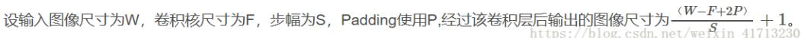
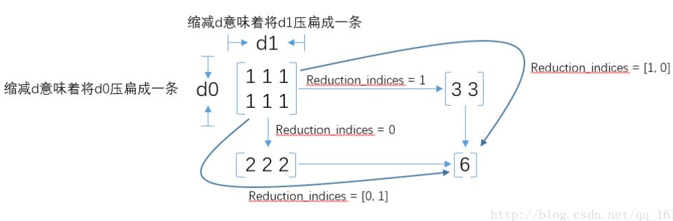
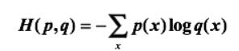

# TensorFlow学习过程的基础使用和总结，不断更新
<!--more-->
### (1).用CNN网络进行图片处理，就会遇到卷积、池化后的图像大小问题，一般搜到的答案是这样的：
### 对于初学者，看到这个公式的唯一疑问是：P值到底是多少？在Tensoflow中，Padding有2个选型，'SAME'和'VALID' ，
### `如果 Padding='SAME'，输出尺寸为： W / S`
### `如果 Padding='VALID'，输出尺寸为：(W - F + 1) / S`

### (2)在处理图像数据的时候总会遇到输入图像的维数不符合的情况，此时tensorflow中reshape()就很好的解决了这个问题`tf.reshape(tensor,shape,name=None)` 
### 函数的作用是将tensor变换为参数shape形式，其中的shape为一个列表形式，特殊的是列表可以实现逆序的遍历，即list(-1).-1所代表的含义是我们不用亲自去指定这一维的大小，函数会自动进行计算，但是列表中只能存在一个-1。（如果存在多个-1，就是一个存在多解的方程)。-1 的应用:-1 表示不知道该填什么数字合适的情况下，可以选择，由python通过a和其他的值3推测出来，比如，这里的a 是二维的数组，数组中共有6个元素，当使用reshape()时，6/3=2，所以形成的是3行2列的二维数组，可以看出，利用reshape进行数组形状的转换时，一定要满足（x,y）中x×y=数组的个数
 ```
>>>a = np.array([[1,2,3],[4,5,6]])
>>>np.reshape(a,(3,-1)) 
array([[1, 2],
       [3, 4],
       [5, 6]])
>>> np.reshape(a,(1,-1))
array([[1, 2, 3, 4, 5, 6]])
>>> np.reshape(a,(6,-1))
array([[1],
       [2],
       [3],
       [4],
       [5],
       [6]])
>>> np.reshape(a,(-1,1))
array([[1],
       [2],
       [3],
       [4],
       [5],
       [6]])
```
### (3)tf.placeholder(dtype, shape=None, name=None)此函数可以理解为形参，用于定义过程，在执行的时候再赋具体的
```
x = tf.placeholder(tf.float32, shape=(1024, 1024))
y = tf.matmul(x, x)
 
with tf.Session() as sess:
  print(sess.run(y))  # ERROR: 此处x还没有赋值.
 
  rand_array = np.random.rand(1024, 1024)
  print(sess.run(y, feed_dict={x: rand_array}))  # Will succeed.
```
### (4)tf.nn.conv2d是TensorFlow里面实现卷积的函数
`tf.nn.conv2d(input, filter, strides, padding, use_cudnn_on_gpu=None, name=None)`
 第一个参数input：指需要做卷积的输入图像，它要求是一个Tensor，具有[batch, in_height, in_width, in_channels]这样的shape，具体含义是[训练时一个batch的图片数量, 图片高度, 图片宽度, 图像通道数]，注意这是一个4维的Tensor，要求类型为float32和float64其中之一

 第二个参数filter：相当于CNN中的卷积核，它要求是一个Tensor，具有[filter_height, filter_width, in_channels, out_channels]这样的shape，具体含义是[卷积核的高度，卷积核的宽度，图像通道数，卷积核个数]，要求类型与参数input相同，有一个地方需要注意，第三维in_channels，就是参数input的第四维

第三个参数strides：卷积时在图像每一维的步长，这是一个一维的向量，长度4

第四个参数padding：string类型的量，只能是"SAME","VALID"其中之一，这个值决定了不同的卷积方式（后面会介绍）就是VALID只能匹配内部像素；而SAME可以在图像外部补0,从而做到只要图像中的一个像素就可以和卷积核做卷积操作,而VALID不行

第五个参数：use_cudnn_on_gpu:bool类型，是否使用cudnn加速，默认为true结果
返回一个Tensor，这个输出，就是我们常说的feature map

### (5)max pooling是CNN当中的最大值池化操作，其实用法和卷积很类似`tf.nn.max_pool(value, ksize, strides, padding, name=None)`参数是四个，和卷积很类似：
第一个参数value：需要池化的输入，一般池化层接在卷积层后面，所以输入通常是feature map，依然是[batch, height, width, channels]这样的shape

第二个参数ksize：池化窗口的大小，取一个四维向量，一般是[1, height, width, 1]，因为我们不想在batch和channels上做池化，所以这两个维度设为了1

第三个参数strides：和卷积类似，窗口在每一个维度上滑动的步长，一般也是[1, stride,stride, 1]

第四个参数padding：和卷积类似，可以取'VALID' 或者'SAME'
返回一个Tensor，类型不变，shape仍然是[batch, height, width, channels]这种形式
### (6)常用的激活函数`tf.nn.relu(features, name=None)  = max(0,features)`
### 一般features会是(卷积核,图像)的卷积后加上bias`tf.nn.relu(tf.nn.conv2d(x_image, w_conv1, strides=[1, 1, 1, 1], padding='SAME') + b_conv1)`


### (7)tf.nn.dropout()是tensorflow里面为了防止或减轻过拟合而使用的函数，它一般用在全连接层`tf.nn.dropout(x, keep_prob, noise_shape=None, seed=None,name=None) `
 x为输入，keep_prob 概率参数可以为 tensor，意味着，训练时候 feed 为0.5，测试时候 feed 为 1.0 就 OK。return：包装了dropout的x。训练的时候用，test的时候就不需要dropout了

 ### (8)通过Softmax回归，将logistic的预测二分类的概率的问题推广到了n分类的概率的问题。`tf.nn.softmax(logits,axis=None,name=None,dim=None)更新说明：dim被弃用，用axis代替`
下面的几行代码说明一下用法
```
import tensorflow as tf
A = [1.0,2.0,3.0,4.0,5.0,6.0]
with tf.Session() as sess: 
print sess.run(tf.nn.softmax(A))
```
结果 
[ 0.00426978 0.01160646 0.03154963 0.08576079 0.23312201 0.63369131]
### dim=-1时，在最后一个维度上进行softmax（默认）
### dim=0时，在第一个维度上进行softmax 

### (9)调用`reduce_sum(arg1, arg2)`时，参数arg1即为要求和的数据，arg2有两个取值分别为0和1，通常用reduction_indices=[0]或reduction_indices=[1]来传递参数。从上图可以看出，当arg2 = 0时，是纵向对矩阵求和，原来矩阵有几列就得到几个值；相似地，当arg2 = 1时，是横向对矩阵求和；当省略arg2参数时，默认对矩阵所有元素进行求和。

### 看到这里，函数名的前缀为什么是reduce_其实也就很容易理解了，reduce就是“对矩阵降维”的含义，下划线后面的部分就是降维的方式，在reduce_sum()中就是按照求和的方式对矩阵降维。那么其他reduce前缀的函数也举一反三了，比如reduce_mean()就是按照某个维度求平均值，等等。

### (10)经典损失函数：交叉熵

###  注意，交叉熵刻画的是两个概率分布之间的距离，或可以说它刻画的是通过概率分布q来表达概率分布p的困难程度，p代表正确答案，q代表的是预测值，交叉熵越小，两个概率的分布约接近。那么，在神经网络中怎样把前向传播得到的结果也变成概率分布呢？Softmax回归就是一个非常有用的方法。（所以面试官会经常问你，为什么交叉熵经常要个softmax一起使用？）
`cross_entropy=-tf.reduce_mean(y_*tf.log(tf.clip_by_value(y,1e-10,1.0)))`

其中y_就代表p,也就是正确结果（或者说标签），y代表q，也就是预测结果（或者说实际输出）。

这里的tf.reduce_mean()是求一个平均值，具体是这样的：

tf.reduce_mean(x):就是求所有元素的平均值；

tf.reduce_mean(x,0):就是求维度为0的平均值，也就是求列平均；

tf.reduce_mean(x,1)：就是求维度为1的平均值，也就是求行平均。

这里的tf.clip_by_value(v,a,b):表示把v限制在a~b的范围内，小于a的让它等于a,大于b的让它等于b。（通俗易懂）

`还有一个要注意的点：代码中的*，这里的*不是矩阵相乘，而是元素之间直接相乘。矩阵乘法需要用tf.matmul函数来完成。`

### 因为交叉熵一般会与softmax回归一起使用，所以TensorFlow对这两个功能进行了同一封装，并提供了tf.nn.softmax_cross_entropy_with_logits函数。比如可以直接通过以下代码实现了sotfmax回归之后的交叉熵损失函数：
`cross_entropy=tf.nn.sparse_sotfmax_cross_entropy_with_logits(label=y_,logits=y)`
### 这里y代表神经网络的原始输出（就是还没有经过sotfmax的输出），而y_是给出的标准答案。

### (11)`tf.argmax(input, axis=None, name=None, dimension=None)`此函数是对矩阵按行或列计算最大值
参数
input：输入Tensor
axis：0表示按列，1表示按行
name：名称
dimension：和axis功能一样，默认axis取值优先。新加的字段
返回：Tensor  一般是行或列的最大值下标向量
```
import tensorflow as tf
 
a=tf.get_variable(name='a',
                  shape=[3,4],
                  dtype=tf.float32,
                  initializer=tf.random_uniform_initializer(minval=-1,maxval=1))
b=tf.argmax(input=a,axis=0)
c=tf.argmax(input=a,dimension=1)   #此处用dimesion或用axis是一样的
sess = tf.InteractiveSession()
sess.run(tf.initialize_all_variables())
print(sess.run(a))
#[[ 0.04261756 -0.34297419 -0.87816691 -0.15430689]
# [ 0.18663144  0.86972666 -0.06103253  0.38307118]
# [ 0.84588599 -0.45432305 -0.39736366  0.38526249]]
print(sess.run(b))
#[2 1 1 2]
print(sess.run(c))
#[0 1 0]
```


