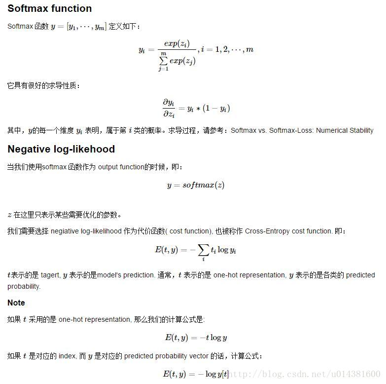

# Cross-Entropy cost function交叉熵损失函数
<!--more-->

### 这种典型的cost函数在tensorflo里面代码如下：把向量化后的图片 x 和权重矩阵 W 相乘，加上偏置 b ，然后计算每个分类的softmax概率值。
```
y = tf.nn.softmax(tf.matmul(x,W) + b)
cross_entropy = -tf.reduce_sum(y_*tf.log(y))
```
### 注意， tf.reduce_sum 把minibatch里的每张图片的交叉熵值都加起来了。我们计算的交叉熵是指整个minibatch的。

### 但是上文的网络的output先经过了softmax操作，tensorflow的默认计算cost函数tf.nn.softmax_cross_entropy_with_logits是不需要在输入前对网络的output进行softmax的：
因此用默认函数计算cost函数方法如下：
```
cross_entropy = tf.nn.softmax_cross_entropy_with_logits(logits,
                                                        onehot_labels,
                                                        name='xentropy')
loss = tf.reduce_mean(cross_entropy, name='xentropy_mean')
```
### 注意这里的onehot_labels需要对样本类别标签进行onthot编码，onehot编码是机器学习中常用的工具，假如当前训练样本共5个类，当前label为3，onthot后为00100，类别5编码后是00001 对应代码是onehot_labelstf.one_hot(y,n_classes)

## 谈一下对损失函数计算的理解 
### 假如batchsize=8 
### 训练样本总类别为5 
### 那么一个batchsize的数据经过神经网络最后的输出为[8，5] 
### 对其进行softmax操作之后每一行5个元素的含义就是属于五个类别的概率，假如当前某一个正确标签为2的softmax输出为[0.1,0.5，0.01，0.3，0..09] 那么它的cost为-log([0.1,0.5，0.01，0.3，0..09])*[0,1,0,0,0]T ,[0,1,0,0,0]T是一个列向量，cost=-log(0.5)=0.3，我们的目的是使得cost最小，由于-log(1)=0是最小值，因此我们就是不断让该样本的分数向着自己正确类别对应的概率靠近。 对于同一个batch内部不用的样本，分别像上面一样计算然后求mean或者sum最后cost的值，然后最小化cost即可！

