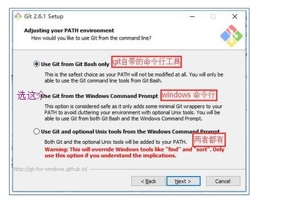

---
title: 搭建个人博客时遇到的问题
date: 2019-03-23 17:53:59
tags: 博客搭建
categories: 闲暇所学

---
# cmd 里面运行git提示“不是内部或外部命令，也不是可运行的程序”的解决办法
<!-- more -->
## 安装完git之后，打开windows系统的cmd，执行git命令老是报错说“git不是内部或外部命令，也不是可运行的程序”。但是在文件目录Git Bash Here运行Git可以。
## 经查询，应该是这个原因，参考：windows安装git和环境变量配置的第七点【7.设置环境，选择使用什么样儿的命令行工具】,安装的时候选择“系统自带CMD：使用windows系统的命令行工具”，即选择第二个“use git from the windows command prompt”。

# 解决方法
### 1.找到你电脑上的git安装中bin的路径，同时，找到git安装路径中git-core的位置

2.配置系统变量。右键“计算机”->“属性”->“高级系统设置”->“环境变量”->在下方的“系统变量”中找到“path”->选中“path”并选择“编辑”->将1中找到的bin和git-core路径复制到其中->保存并退出。（注意，系统变量path的配置中，每个路径之间以分号;分割）

3.重新执行git命令，还是报一样的错，然后重启了一下电脑就OK啦。
